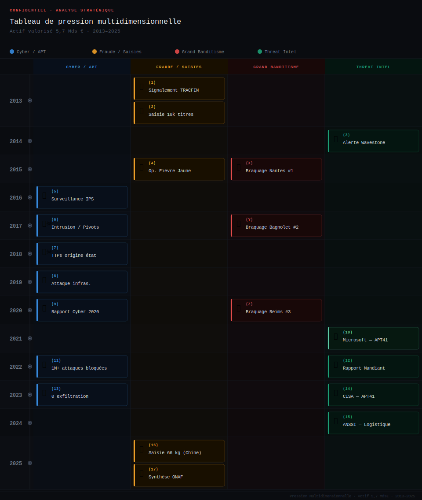

## ⚠️ AVERTISSEMENT IMPORTANT

**Ce document constitue une analyse rétrospective à finalité strictement pédagogique d'une infrastructure n'existant plus (entité dissoute le 30/06/2023).** 

- **Aucune attribution formelle** à un État ou groupe spécifique n'est effectuée
- **Les noms de sociétés tierces** mentionnées le sont dans un contexte factuel et pédagogique, sans intention de nuire à leur réputation
- **Toutes les informations** proviennent exclusivement de sources publiques

Cette publication unique vise exclusivement à valoriser une expertise acquise sur un cas historique exceptionnel.

# Threat Intelligence Case Study
**Corrélation APT & Belt and Road Initiative (2016-2023)**

---
**INTRODUCTION : — Anatomie d'une Défense Multidimensionnelle (2012-2023)**

🌐 L'AVANT-MATCH : Une Traque Hybride & Géopolitique
Ce document ne relate pas une simple défense périmétrique, mais une investigation multidimensionnelle sur un actif souverain traitant ~6 Mds € annuels. Bien avant l'ouverture du match technique, une stratégie de défense proactive a été bâtie sur trois piliers :

🕵️ Intelligence Géopolitique (OSINT) : Suivi des tensions technologiques mondiales, notamment la Guerre de la 5G (US/Chine) dès 2011, pour anticiper la compromission des infrastructures critiques.

🗺️ Cartographie de la Menace (BRI) : Identification d'une corrélation stricte entre les corridors de la "Route de la Soie" (Belt and Road Initiative) et l'origine géographique des assauts (Kazakhstan, Kenya, Éthiopie, etc.) détectés sur les consoles IPS + Confirmation vendors CTI à postériori.

🏗️ Architecture Anti-Fragile : Design structurel Full Mesh Multi-Datacenter et hardening chirurgical (Serveurs Web, SFTP, FTPS) visant à briser la rentabilité économique de l'attaquant en neutralisant le DDoS le design.

⚡ LE POINT DE RUPTURE : La Bataille des FUD
« L'adversaire n'a plus d'autre choix que de mobiliser ses ressources les plus coûteuses, et il va le faire. »

Face à une défense qui ne cédait plus, la menace a muté vers l'engagement d'armes d'élite. Cette étude documente la capture de payloads FUD (Fully UnDetectable), restés furtifs de 2020 jusqu'en 2026, confirmant un acharnement compatible avec les TTPs des acteurs APT (Confirmation Mitre + Vendors CTI).

📦 LA PREUVE CYBER-PHYSIQUE : Le Fil d'Ariane Logistique
L'ultime force de cette analyse réside dans le suivi des événements matériels validant l'offensive numérique :

💰 Blanchiment Documenté : Identification précoce, via la presse et les rapports TRACFIN (2013-2015), d'une infrastructure de cash-out opérant à travers des réseaux de restauration complices.

🏭 Confirmation Industrielle : Suivi des saisies douanières (sur 12 ans) passant de 10 512 titres en 2013 à un record de 66 kg (59 031 titres) en 2025, prouvant une montée en puissance de la contrefaçon industrielle persistante.

📌 Ceci est une synthèse stratégique de l'étude ; la version intégrale détaillée est disponible sur demande.

---

## ⚠️ Problème

France, début 2016. Responsable réseau et sécurité périmétrique dans une infrastructure critique nationale de compensation (titres-restaurant). 
L'infrastructure critique en question traite :
- **100% du marché français** des titres-restaurant papier
- **~750 millions** de titres traités annuellement
- **~6 milliards €** de transactions annuelles
- **~180 000 établissements affiliés**

**Détection de signaux faibles et renforcement des défenses**
La surveillance des Syslogs, Apache access/error logs, auth.log et Awstat a permis d’identifier des attaques anodines mais dispersées géographiquement, révélatrices de tentatives de reconnaissance ou de préparatifs d’intrusion. Pour y répondre, une stratégie défensive progressive a été adoptée : dans un premier temps, un module IPS couplé à une console de management centralisée a été déployé pour bloquer les menaces connues et corrélation les événements suspects. Cependant, face à la menace croissante des attaques discrètes par petits paquets (comme les attaques DoS de type Slowloris), qui entraînent une baisse significative des performances des systèmes de protection traditionnels, une deuxième couche IPS avancée a été ajoutée. Dotée d’une capacité de traitement élevée, cette solution permet d’absorber les attaques massives et de neutraliser les trafics malveillants, même lorsqu’ils exploitent des paquets de très petite taille.

**Pattern émergent.** Attaquants sophistiqués. Sources : Russie, États-Unis, Kazakhstan, Ouzbékistan, Iran, Chine, Turquie, Brésil. Blocage géographique → disparition. Réapparition Kenya. Nouveau blocage → évaporation. Réapparition Éthiopie, Djibouti, Allemagne, Tanzanie, Rwanda, Madagascar, Mozambique, Ouganda, Burundi. **Même cible systématiquement.**

**RETEX :** 
Early Warning. Identification de patterns **avant** signatures. La persistance prouve qu'il ne s'agit pas de bruit de fond (scanners automatiques) mais d'une mission. Un robot s'arrête au blocage ; un soldat cherche une autre porte.

quelques attaques bloqués :
| Période     | Menace & Signaux Faibles             | Cible Technique               | La Parade mise en place                 | Résultat/RETEX                         |
| :---------- | :----------------------------------- | :---------------------------- | :-------------------------------------- | :------------------------------------- |
| **2016**    | **DoS "Discret"** (type Slowloris).  | Serveurs **Web** (Conns).     | **Hardening** : Limite sessions par IP. | Arrêt des crashs ;                     |
| **2016-17** | **Exploitation** (Struts / Traversal)| Infrastructure Web & Configs. | **IPS ** + Console de mgmt.             | Détection patterns avant signatures.   |
| **2017-18** | **Instabilité** & DDoS Volumétrique. | **Firewall** (Failles IKE).   | **Haute Disponibilité (HA)** + Patchs.  | Résilience et continuité de flux.      |

La réponse était un mélange de fine tunning sur les serveurs et une architecture anti-fragile, qui a brisé la rentabilité de l'attaque. 

L'adversaire n'a plus d'autre choix que de mobiliser ses ressources les plus coûteuses, et il va le faire. (gardez cette phrase en mémoire nous allons y revenir)

### Exemple de hardening système (Standards publics de référence)

Les configurations de sécurité suivantes sont issues de bonnes pratiques documentées dans la littérature spécialisée (Linux Magazine, MISC, ANSSI, CIS Benchmarks) et représentent des standards de durcissement reconnus :

**Serveurs Web (Apache/Nginx) :**
- Limitation des ressources : `MaxRequestWorkers`, `KeepAliveTimeout`, `Timeout`(utile pour Slowloris)
- Protection anti-slow attacks : `mod_reqtimeout`, `mod_evasive` (utile pour Slowloris)
- Tests de résilience : `slowhttptest`, `slowloris` (outils de validation)-(utile pour Slowloris)
- Headers de sécurité : `X-Forwarded-For`, redirection HTTP→HTTPS forcée (utile pour Slowloris & Struts / Traversal)
- Détection d'intrusion : fichiers canary, honeypots (utile pour Struts / Traversal)

**Serveurs SFTP/SSH :**
- Authentification renforcée : clés SSH (recommandation standard), désactivation root (`PermitRootLogin no`) - (utile pour contrer le Mouvement Latéral)
- Restriction d'accès : `AllowUsers`, `chroot` strict, SFTP sans shell (utile pour contrer le Mouvement Latéral et l'Exfiltration)
- Protection brute-force : `Fail2ban`, (limitation tentatives Brute-force / Déni de Service)
- Obfuscation basique : modification port par défaut (débat : sécurité par obscurité vs réduction bruit)

**Serveurs applicatifs et bases de données :**
- Principe du moindre privilège (comptes dédiés, droits minimaux)
- Séparation des environnements (production/dev/test isolés)
- Journalisation renforcée et corrélation d'événements

**Note méthodologique :** Ces configurations représentent des standards industriels largement documentés et ne constituent pas un savoir-faire propriétaire. Elles sont applicables à tout environnement nécessitant un durcissement de surface d'attaque.

**Sources :** ANSSI (Guide de sécurisation Apache/SSH), CIS Benchmarks, Linux Magazine, MISC, documentation officielle Apache/OpenSSH.


### Rôle de l'architecture : Défense en profondeur (Defense in Depth)

L'architecture réseau joue un rôle déterminant dans la résilience d'une infrastructure critique. Le principe de défense en profondeur repose sur la multiplication des couches de contrôle et l'absence de confiance implicite entre zones.

**Exemple de modèle multi-couches (principe architectural standard) :**
```
ENTRÉE : Internet
  ↓
Saut 1 : Firewall périmétrique (DNAT vers DMZ publique)
  ↓
Saut 2 : Reverse Proxy frontal (façade publique, terminaison SSL)
  ↓
Saut 3 : Reverse Proxy applicatif (backend privé, filtrage applicatif)
  ↓
FILTRE : Firewall inter-zones (contrôle DMZ-to-DMZ)
  ↓
Segmentation par services :
  - DMZ 2 : Service Web A (isolation logique)
  - DMZ 3 : Service Web B (VLAN distinct)
  - DMZ 4 : Service Applicatif C (zone de confiance réduite)
  - DMZ 5 : Service Données D (accès restreint)
```

**Principe de rupture protocolaire et cloisonnement :**

Ce modèle architectural repose sur plusieurs mécanismes défensifs complémentaires :

1. **Ruptures protocolaires successives** : Chaque saut impose une terminaison/réinitialisation de connexion, empêchant la visibilité réseau de bout en bout.

2. **Segmentation stricte** : L'étanchéité inter-DMZ (firewall + ACL) élimine toute confiance transitive entre zones de service.

3. **Mouvement latéral entravé** : Un attaquant ayant compromis une zone doit franchir séquentiellement chaque couche de contrôle, sans visibilité sur les zones adjacentes. Le scan réseau devient inefficace, la progression nécessite une compromission répétée et coûteuse.

4. **Coût d'attaque asymétrique** : La multiplication des contrôles augmente exponentiellement l'effort requis pour une intrusion complète, rendant l'exploitation économiquement non viable pour la majorité des acteurs.

**Bénéfice défensif :**  
Cette architecture impose une friction telle que le ratio coût/bénéfice de l'attaque devient défavorable pour l'adversaire. Même en cas de compromission initiale (phishing, 0-day périmétrique), la progression vers les actifs critiques reste bloquée par les contrôles internes.

**Note :** Ce modèle représente un standard architectural reconnu, applicable à toute infrastructure nécessitant une haute résilience. Il ne décrit pas une configuration spécifique mais illustre les principes généraux de cloisonnement et de rupture de confiance. 

**Sources :** ANSSI (Guide défense en profondeur), NIST SP 800-53 (Security Controls), CIS Controls (Network Segmentation), architecture Zero Trust (principes de segmentation).

### Autres idées

**Hardening par contrainte physique (ou Physical Resource Constraining).** 
Vous pouviez en 2010 installer certains serveurs Linux avec 2 Go de stockage (1,2 Go de libre après l'installation du Kernel+CORE) = l'attaquant ne dispose pas de l'espace nécessaire pour télécharger ou compiler des kits d'exploitation volumineux. De l'asphyxie physique.

Résilience par l'asphyxie et la segmentation : L'exfiltration massive est neutralisée par l'absence d'espace disque (1,2 Go libres) :
-L'attaquant ne dispose pas de l'espace nécessaire pour télécharger ou compiler des kits.
-L'attaquant ne peut pas faire du stockage de rebond ou d'archivage local. 
-Chaque action de l'attaquant est limitée par la saturation immédiate des ressources, rendant toute progression pénible et hautement détectable par les alertes de seuil disque (Ex : Script Nagios check_disk avec un Check Interval agressif). 

Cette contrainte physique, couplée à l'obligation de franchir quatre sauts successifs pour chaque flux, impose une friction telle qu'elle épuise les capacités des meilleurs attaquants.

En l'absence d'IPS, la corrélation entre une anomalie réseau (AWStats/Webalizer/Analog) et une charge CPU imprévue (Nagios/Zabbix) rend l'infrastructure auto-détectrice. (Cacti pour les graphes).

P.S : Pour les serveurs dépassant 2Go, par exemple 6Go, Il n'était pas exclu de voir snort en HIDS sur le même serveur qu'Apache (avec une rotation des logs agressive). Quant aux serveurs dépassant 25 Go, ils étaient sanctuarisés pour la métrique longue durée (Cacti & RRDtool/MRTG & RRDtool), garantissant une visibilité historique immuable sur plusieurs années.

Pour pousser plus loin cette architecture vous pouvez ajouter un modem GPRS à votre console de monitoring ça garantira une notification hors-bande immédiate : même en cas de compromission ou de coupure totale du réseau de production, l'alerte transite par le réseau mobile, **hors de portée de l'attaquant**. ⚠️Les API SMS sont des vecteurs de vulnérabilité car elles dépendent de la connectivité Internet. 

Pour les serveurs recyclés de spare on pouvait les transformer Shorewall Firewall standalone (Aujourd'hui Pfsense) pour tests ou pour verrouiller un peu plus, si besoin. En s'inspirat des stratégie de défense (en avance dès 2010) carrier-grade, c’était le signe manifeste qu'une guerre était déjà déclarée pour maintenir un système d'information debout.

« En 2012, le D.G. pousse la porte de mon bureau avec une pointe de satisfaction : "Sommes-nous enfin assez protégés ?" m'interroge-t-il. C'était l'année où le Qatar s'offrait le PSG ; le monde changeait de dimension, et notre défense se devait de suivre la même trajectoire. Ma réponse fut sans appel : "Non. En sécurité, le sommet n'est qu'un plateau avant la prochaine escalade."

Un silence, puis il a ajouté cette phrase que tout expert attend une fois dans sa carrière : "Envoie-moi l'architecture de tes rêves !"

Finie l'ère du recyclage, place à l'artillerie lourde , vous l'avez compris l'architecture va changer. 
...
...
(RETEX complet sur demande)


## ❓ Questions

**Question opérationnelle :** *"Qu'est-ce qu'un habitant de Dar es Salaam ferait de numéros de série de tickets-restaurant français ?"*

Pour exploiter ce système, il faut :

- ✅ **UN MOBILE ÉCONOMIQUE** — ROI réel sur ~6 Mds€ de transactions de la structure
- ✅ **UNE INFRASTRUCTURE LOGISTIQUE vers la France** — Capacité d'acheminer des cartons de faux titres papier + Capacité cash-out
- ✅ **UNE CONNAISSANCE DU SYSTÈME** — Comprendre l'architecture de la structure (~750M titres/an)
- ✅ **UNE CAPACITÉ OPÉRATIONNELLE** — Ressources pour une traque de plusieurs années
- ✅ **UN RÉSEAU DE BLANCHIMENT** — Établissements complices pour écouler les titres (évitement TRACFIN)

**RETEX :** Passage du "Quoi" (les logs) vers le "Pourquoi" (la finalité). Grille d'analyse multidimensionnelle. Chaque pays source d'attaque doit être passé à la moulinette : mobile économique ?, logistique France ?, connaissance du métier ?, capacité technique sur 6 ans (minimum) ?, réseau de blanchiment ?. 
Si un suspect ne coche pas "logistique physique vers la France", son IP n'est qu'un paravent.
On ne cherche plus un simple pirate, mais une organisation capable de boucler la boucle : du serveur jusqu'au commerçant de rue.

---

## ✨ Réponse

### 2013-2023 — Réseau de Blanchiment Documenté

Première piste concrète : rapports TRACFIN.

"Blanchiment d'argent : le filon des tickets resto"  
*"Petits restaurants **chinois** d'Ile-de-France [...] 2.000 clients par jour détectés par Tracfin"*  
[Europe1, Publié le 09/08/2013 à 18:52 - Mis à jour le 19/02/2025 à 12:16] [PDF 1]

"Des tickets resto pour blanchir de l'argent sale"  
*En quelques mois, un groupe de plusieurs restaurateurs **chinois** a "nettoyé" pas moins de 10 millions d'euros, par le truchement du remboursement de tickets resto.*  
[L'Express. Publié le 09/08/2013 à 15:20, mis à jour le 17/02/2014 à 13:46] [PDF 2]

"Opération Fièvre jaune contre le Chinatown d'Aubervilliers"  
*Des grossistes **chinois** d'Aubervilliers ont-ils servi de blanchisseurs aux barons marocains du trafic de cannabis ? Dix-sept personnes ont été mises en examen cette semaine dont neuf ont été écrouées."*  
[LeJDD, Stéphane Joahny, 21/06/2015, mis à jour 06/06/2023] [PDF 3]

**RETEX :** Identification de l'Infrastructure de Sortie (**Cash-out Infrastructure**). Recoupement TRACFIN/judiciaire confirme : outil de blanchiment "en production" avant même le pic des offensives cyber (Recoupement fait entre 2013 et 2015 **OSINT** et **HUMINT**).

**Note importante :** *Les références aux "restaurants chinois" proviennent de la presse nationale française (Europe1, L'Express, LeJDD) citant les rapports TRACFIN et les démantèlements judiciaires. Ce ne sont pas des affirmations de l'auteur.*

---

### Saisies Douanières — Confirmation Industrielle sur le long terme, 2013 à 2025 (12 ans)

*"576 000 euros de faux tickets restaurant saisis en Seine-et-Marne"*  
[mesinfos.fr, lundi 20 janvier 2025] [Pdf 5]

*"Plus de 576 000 € de faux titres-restaurant saisis en Seine-et-Marne, un record"*  
[ouest-france.fr Publié le 17/01/2025] [Pdf 6]

| Date            | Source              | **Nombre de titres**                        | **Valeur**     | Détails                                     |
|-----------------|---------------------|---------------------------------------------|----------------|---------------------------------------------|
| **16/11/2013**  | L'Est Républicain   | **10 512 tickets**                          | **110 376 €**  | 1ère saisie France, aéroport Bâle-Mulhouse  |
| **17/01/2025**  | Le Parisien         | **59 031 tickets** (2 811 carnets × 21 titres) | **576 290 €**  | Record France, 66 kg, 5 cartons             |

**Preuve** : ×6 quantité, ×5 valeur en **12 ans**. Production **industrielle persistante**.

---

### La Convergence (2016-2023)

Les cinq critères en croisant ce qui est observé avec ce qui est documenté publiquement :

- ✅ **MOBILE ÉCONOMIQUE** — ~6 Mds€ de transactions annuelles. Marché 100% français mais exploitable via contrefaçon industrielle
- ✅ **INFRASTRUCTURE LOGISTIQUE** — Capacité d'acheminement vers la France (confirmée **a posteriori** par saisies douanières de cartons tickets restaurant 2025)
- ✅ **CONNAISSANCE SYSTÈME** — 6 ans de tentatives ciblées sur la structure
- ✅ **CAPACITÉ OPÉRATIONNELLE** — Persistance sur 6 ans = ressources durables (étatiques ou para-étatiques)
- ✅ **RÉSEAU DE BLANCHIMENT** — Infrastructure documentée par TRACFIN et démantèlements judiciaires

👤 **Un seul acteur réunit ces cinq facteurs simultanément.**

💡 **Hypothèse de travail** : Acteur para-étatique ou criminalité organisée bénéficiant de protections/tolérances, basé en Asie de l'Est, exploitant une infrastructure logistique et financière préexistante.

---

## 🗺️ Analyse Géographique — Le Pattern BRI

**Question :** "Pourquoi ces pays-là, précisément ?" Russie, Kazakhstan, Ouzbékistan, Kenya, Éthiopie, Tanzanie, Djibouti, Rwanda, Madagascar, Mozambique, Ouganda, Burundi, Allemagne, Iran, Turquie, Brésil...

**Tous ces pays sont partenaires ou relais de la Belt and Road Initiative (BRI)**, projet d'infrastructure lancé par la Chine en **2013**.

### Corrélation Temporelle BRI ↔ Attaques

| **Date**    | **Événement BRI**                                                                               -| **Observation Sécurité**                             |
|-------------|--------------------------------------------------------------------------------------------------|----------------------------------------------------  |
| Sept. 2013  | Annonce officielle (Astana, Kazakhstan): "Partenariat Chine-Kazakhstan-Kirghizistan-Ouzbékistan" |                                                      |
| 2016        | Déploiement volet maritime Afrique : *"Djibouti, Kenya, Tanzanie, Madagascar"* [Géoconfluences]  | **Début campagne sur la structure** janv. 2016)      |
| 2018-2019   | Intensification investissements Afrique de l'Est                                                 | **Pic d'attaques Kenya, Éthiopie, Tanzanie, Rwanda** |
| 2020        | Corridors LAPSSET opérationnels (Mombasa, Dar es Salaam)                                         | **Attaques depuis Mozambique, Ouganda**              |
| Oct. 2023   | Sommet BRI Pékin : 1 000 Mds$ investis, 130 pays                                                 | **Fin de ma traque**(mai 2023, fin de mission)       |

Ce parallélisme entre l’expansion physique de la BRI et la chronologie des attaques cyber est pour le moins troublante. 

Vous vous souvenez certainnement de la guerre de la 5G qui a accompagné le déploiment de la BRI (Guerre qui est toujours d'actualié 2012-2026) ?

Le doute a été mis depuis **2012** sur le déploiement du réseau 5G Huawei et ZTE, Preuve :

**2012** Le Comité permanent spécial de la Chambre des représentants sur le renseignement U.S : [Pdf 8]
« le Comité a lancé cette enquête en novembre **2011** afin d’examiner la menace de contre-espionnage et de sécurité **que représentent les entreprises de télécommunications chinoises** opérant aux États-Unis.
"Investigative Report on the U.S. National Security Issues Posed by Chinese TelecommunicationsCompanies Huawei and ZTE"
[stanford.edu & intelligence.house.gov U.S. House of Representatives 112th CongressOctober 8, 2012] 
"The House Permanent Select Committee on Intelligence (herein referred to as “the Committee”) initiated this investigation in November **2011** to inquire into
the counterintelligence and **security threat** posed by **Chinese telecommunications companies** doing business in the United States."

**2019** "Chine - Etats-Unis : avec Huawei, **la guerre de la 5G** est déclarée"
"Donald Trump accuse le groupe de téléphonie d’être une **menace sécuritaire**"
[lemonde.fr Publié le 01 février 2019 à 13h28, modifié le 01 février 2019] [Pdf 8]

**2019** "Huawei, chronologie d’une **crise ouverte** entre la Chine et les États-Unis"
[lefigaro.fr Le 21 mai 2019] [Pdf 9]

Comme le souligne le CSIS (2023), **la Chine** utilise la BRI et la DSR pour étendre son influence technologique et faciliter des **opérations cyber** ([Source : CSIS, 2023](https://www.csis.org/analysis/countering-threats-ccp-homeland)) [Pdf 7].

**2026** "La Commission européenne propose des mesures pour renforcer davantage la résilience et les capacités **cybersécurité** de l'UE. Avec à la clé l'exclusion de fournisseurs étrangers et en particulier Huawei et ZTE pour ses réseaux 5G."
[lemondeinformatique.fr publié le 21 Janvier 2026] [Pdf 10]

L'évolution des positions internationales entre 2012 et 2026 révèle une prise de conscience globale : l'infrastructure télécom n'est plus un simple outil commercial, mais le socle de la souveraineté nationale. Alors que le Congrès américain alertait dès 2012 sur les risques d'espionnage liés à Huawei et ZTE, les rapports du CSIS (2023) confirment que la Route de la Soie Numérique sert désormais de levier pour faciliter des opérations cyber à l'échelle mondiale. Cette trajectoire culmine en 2026 avec la décision de l'Union européenne d'exclure ces équipementiers de ses réseaux 5G, actant ainsi le passage d'une méfiance diplomatique à une stratégie de protection structurelle face aux menaces persistantes.

Et nous dans tout ça ?

**RETEX :** En 2012 (L'année du rapport du comité permanent spécial de la Chambre des représentants sur le renseignement U.S), notre D.G qui n'avait pas formation EBIOS RM (sortie 2018), mais pratiquaient déjà l'analyse de risque m'a posé une simple question : "Et si tout s'effondre ?". 
Ma réponse, moi qui galairais avec mes logs apache : "Ca tombe bien car je voulais te parler d'un projet de redondance et de séurité"
xxx.xxx.x.xxx - - [10/Feb/2012:10:00:01 +0100] "GET /admin.php?id=1' OR '1'='1' HTTP/1.1" 404 286 "-" "OWASP ZAP" (on voit le nom de l'outils)
Lucidité stratégique + vision technique infrastructure anti-fragile. Résultat : 14 ans de résilience anticipant EBIOS RM de 6 ans, en neutralisant par exemple les attaques type DDoS par un design structurel (HA), nous avons brisé la rentabilité de l'attaque. 

Note : Bien qu'EBIOS fût déjà formalisée en 2010, sa mise en pratique restait rare.

--
### Le passage du constat de terrain à la validation analytique  CTI.

« Ma démarche combine renseignement de terrain (presse, douanes), analyse OSINT (géopolitique) et expertise technique. La Phase 1 (Détection et collecte) est close. La Phase 2 consiste désormais à confronter mes données aux référentiels mondiaux (Mandiant, MITRE, FireEye) pour identifier à quels acteurs ou campagnes ces faits sont officiellement rattachés par les vendors CTI. »


**Phase 1 ( **Sources HUMINT**, **Traitement OSINT** et  **Action Technique**) : terminée.**
**Phase 2 (Rétro-validation post-défense) : démarrage.**

Voyons maintenant à qui Mandiant, MITRE ATT&CK FrameWork et FireEye (Vendors CTI) vont attribuer ces campagnes !.

**Note importante :** *L'attribution à partir de là va sefaire en se basant sur **Mitre, Microsoft, Mandiant, Sekoia, FireEye,CSIS**. C'est de la VALIDATION par sources tierces, pas de l'attribution maison.

## 🔬 Analyse Comparative & Levée de Doute (CTI)

### 🛡️ Registre de Traque (2018-2020) — Focus "Route de la Soie"

*Note : IPs sources réelles , Security Intelligence & Intrusion Events (2018-2020). Les IP ont été retirées par mesure de confidentialité.*

| Année | Mois       | Origine      | Détails Techniques                        | MITRE ATT&CK             | Grp APT/Acteurs                     |
|-------|------------|--------------|-------------------------------------------|--------------------------|-------------------------------------|
| 2018  | Janvier    | Chine        | Brute Force SSH : Bloqués                 | T1110.001 Brute Force    | **APT41**, **APT10**                |
| 2018  | Février    | Ukraine      | Botnet CnC : bloquées                     | T1071.001 (C2)           | **CybCri(Emotet)**, **APT29**       |
| 2018  | Mars       | Turquie      | Scanning : failles (Joomla/PHP)           | T1595.002                | **CybCri**, **APT-C-23** (grp turc) |
| 2018  | Mai        | Iran         | SQL Injection : Tentatives d'extraction   | T1190                    | **APT33**, **APT34**                |
| 2018  | Septembre  | Kazakhstan   | SMTP Relaying : Relais Spam               | T1078.003                | **Cybercriminels**, **APT41**       |
| 2018  | Octobre    | Canada       | IIS Exploit : Cible Windows               | T1190                    | **CybCri**, **APT29**               |
| 2018  | Novembre   | Ouzbékistan  | Credential VPN Stuffing                   | T1110.004 Credential     | **CybCri**, **APT41**               |
| 2019  | Janvier    | Brésil       | RCE (Code Execution)                      | T1059 (Cmd-Line Iface)   | **CybCri**, **APT-C-36**            |
| 2019  | Mars       | Kenya        | DNS Malware : Requêtes (.tk/.pw)          | T1071.004 (DNS)          | **APT41** (BRI), **CybCri**         |
| 2019  | Mai        | Éthiopie     | DDoS / Flood : Tconnexions DMZ            | T1498.001 (Network DoS)  | **Cybercriminels**, **APT41**       |
| 2019  | Juillet    | Tanzanie     | Malware Phishing :(.doc/.pdf)             | T1566.001 (Attachment)   | **APT41**, **CybCri**               |
| 2019  | Septembre  | Rwanda       | Port Probing : Analyse furtive ports DMZ  | T1046 (Net Srvc Scann)   | **APT41**                           |
| 2019  | Novembre   | Madagascar   | Web Defacement : modif contenu web        | T1565.001 (Defacement)   | **Cybercriminels**, **APT41**       |
| 2020  | Janvier    | Espagne      | 201 connex tentées-Talos "Questionable"   | T1133 Ext Remote Servc   | **Cybercriminels**                  |
| 2020  | Janvier    | Mozambique   | Exploitation VPN : (télétravail)          | T1133 (vuln VPN)         | **APT41**                           |
| 2020  | Mars       | Russie       | C&C: Tentative d'exfiltration Russie      | T1071 (App Layer Prot)   | **APT29**, **APT28**                |
| 2020  | Septembre  | Lituanie     | Attaque Port 8xxx : Scanning              | T1046 Net Servs Scann    | **APT29**                           |
| 2020  | Septembre  | Seychelles   | Attaque Port 8xxx : Brute Force SFTP      | T1110.001 (Brute Force)  | **Cybercriminels**                  |

---

### 🛡️ Résumé des Détections de Logiciels Malveillants bloqués (2020)

Revenons à notre phrase : « L'adversaire n'a plus d'autre choix que de mobiliser ses ressources les plus coûteuses, et il va le faire. »

Là il va le faire !

Face à une défense qui ne cède plus, l’attaquant sort de l'ombre ses ressources FUD (Fully UnDetectable). Il abandonne les vecteurs de masse pour ses armes d'élite : des payloads restés furtifs de 2020 jusqu’à aujourd'hui, 2026.

**Période d'analyse : échantillons pris au hasard 01/01/2020 au 18/12/2020**

| Catégorie Détection  | Échantillon | Type    | Occurrences |
|----------------------|-------------|---------|-------------|
| Malware Sophistiqué  | Sample-06   | PDF     | 1           |
| Malware Sophistiqué  | Sample-06   | PDF     | 1           |
| Malware Sophistiqué  | Sample-07   | PDF     | 2           |
| Exploit Office       | Sample-01   | MSOLE2  | 1           |
| Exploit Office       | Sample-02   | MSOLE2  | 1           |
| Exploit Office       | Sample-03   | MSOLE2  | 1           |
| Exploit Office       | Sample-04   | MSOLE2  | 1           |
| Exploit Office       | Sample-08   | MSOLE2  | 1           |
| Exploit Office       | Sample-05   | MSOLE2  | 2           |
| Exploit Office       | Sample-09   | MSOLE2  | 1           |

---

### État de la Télémétrie Publique (Rapports VirusTotal par Hashes - Jan 2026)

| Échantillon | Type | Détection VT | Tags Comportementaux                      | Analyse de la Menace                                                        |
|-------------|------|--------------|-------------------------------------------|-----------------------------------------------------------------------------|
| Sample-01   | DOC  | 37/59        | executes-dropped-file, direct-cpu-clock   | Dropper : exécute un payload caché et détecte l'analyse via l'horloge CPU   |
| Sample-02   | XLS  | 39/61        | long-sleeps, calls-wmi, detect-debug      | Stealth Malware : sophistiqué, évasion sandbox sleep/persistance via WMI    |
| Sample-03   | DOC  | 45/63        | executes-dropped-file                     | Taux de détection massif. Conçu pour l'infection système immédiate          |
| Sample-04   | DOC  | 45/62        | executes-dropped-file                     | Variante dropper, probablement lié à une campagne de malspam coordonnée     |
| Sample-05   | DOC  | 46/62        | auto-open, obfuscated, macros, hide-app   | Trojan/Backdoor: se cache dans Word, arrière-plan via des macros obfusquées |
| Sample-06   | PDF  | 15/59        | attachment                                | Exploit PDF : Utilise une vulnérabilité Adobe plutôt qu'une macro           |
| Sample-07   | PDF  | 0/59         | FUD candidate                             | Cible Spécifique : Non détecté mondialement. Probable "Zero-Day"/ultra-ciblé |

---

### 📊 Analyse des Empreintes Numériques : Mapping des Hashes vers les TTPs MITRE

| Échantillon | Format | Détection VirusTotal | Tags VirusTotal          | Technique MITRE | Description                                         |
|-------------|--------|----------------------|--------------------------|-----------------|-----------------------------------------------------|
| Sample-06   | PDF    | 15/59                | attachment               | T1203           | Exploit de faille dans un lecteur PDF               |
| Sample-07   | PDF    | 0/59                 | (Aucun)                  | T1566.001       | Spearphishing suspect (Zero-Day ou malware ciblé)   |
| Sample-01   | DOC    | 37/59                | exec-dropped,direct-cpu  | T1497.001       | Évasion de sandbox via détection de l'horloge CPU   |
| Sample-02   | XLS    | 39/61                | wmi, sleeps, debug       | T1047           | Exécution discrète via WMI                          |
| Sample-03   | DOC    | 45/63                | executes-dropped-file    | T1105           | Téléchargement d'un second payload                  |
| Sample-04   | DOC    | 45/62                | executes-dropped-file    | T1105           | Variante de campagne Malspam coordonnée             |
| Sample-08   | DOC    | 41/60                | (Aucun)                  | T1204.002       | Nécessite une ouverture manuelle du fichier         |
| Sample-05   | DOC    | 46/62                | hide-app, obfuscated     | T1564.003       | Dissimulation de l'application pendant l'infection  |
| Sample-09   | DOC    | 42/63                | executes-dropped-file    | T1105           | Extraction d'un binaire (.bin) malveillant          |

---

### 🎯 Profilage de la Menace : Évaluation de la Sophistication et Scénarios d'Attribution (Mapping TTPs). 

| Échantillon | Profil Technique           | Origine Possible       | Technique MITRE | Compatible BRI | Justification                                    |
|-------------|----------------------------|------------------------|-----------------|----------------|--------------------------------------------------|
| Sample-02   | Macros + WMI               | Chinoise probable      | T1047           | Possible       | WMI + macros = TTPs étatiques chinois fréquents  |
| Sample-05   | Obfuscated + hide-app      | État-nation            | T1564.003       | Possible       | Persistance sophistiquée = niveau APT            |
| Sample-06   | Attachment exploit         | Multi-attribution      | T1203           | Neutre         | Technique générique (APT + cybercrime)           |
| Sample-07   | Zero-détection             | Inconnu                | T1566.001       | Neutre         | Fichier "clean" VT = ciblage précis              |
| Sample-01   | Sandbox evasion            | État-nation            | T1497.001       | Possible       | Évasion CPU = sophistication APT                 |
| Sample-03   | Dropped files              | Campagne coordonnée    | T1105           | Possible       | Payloads multiples = stratégie APT               |
| Sample-04   | Dropped files              | Campagne coordonnée    | T1105           | Possible       | Même TTP = même acteur probable                  |
| Sample-08   | User execution             | Multi-attribution      | T1204.002       | Neutre         | Technique basique, large usage                   |
| Sample-09   | Payload.bin extraction     | Campagne coordonnée    | T1105           | Possible       | .bin explicite = phase 2 attaque                 |

**📋 Méthodologie** : TTPs cohérents campagne unique - Pas d'attribution formelle

---

### 🏁 Conclusion de l'Analyse CTI

**La Triple Convergence**

Ce qui transforme ces observations en hypothèse sérieuse :

**Géographique** : Sources d'attaques proviennent de pays BRI, suivant la chronologie exacte des investissements (2013 → 2020).

**Technique** : TTPs identifiés (T1047 WMI, T1564.003 Hidden Window) correspondent à des groupes documentés pour l'espionnage économique en soutien à des intérêts étatiques.

**Physique** : Saisies douanières (cartons de Chine) et rapports TRACFIN (réseau restaurants) confirment l'existence d'une infrastructure logistique cohérente avec cette hypothèse.

**Opérationnelle** : Six ans de persistance. Ce n'est pas du cybercrime opportuniste. C'est une campagne de long terme nécessitant des ressources durables.

**Ce Que Je Peux Affirmer :**
Une menace sophistiquée, persistante, géographiquement structurée selon un axe infrastructurel documenté (BRI), disposant de capacités techniques avancées et d'une chaîne logistique transfrontalière, a ciblé la structure pendant six ans dans un objectif probable d'espionnage économique et de fraude industrielle.

**Ce Que Je Ne Peux Pas Prouver :**
**L'identité exacte de l'acteur décisionnel**. Sans accès à l'infrastructure C2 adversaire, sans validation par renseignement d'État (ANSSI, DGSE), toute attribution formelle reste impossible.

L'apport des vendors CTI vient simplement homologuer par le code ce que les saisies de douane et les rapports de police suggéraient déjà : **ils apposent un matricule technique (le groupe APT) sur une source géopolitique déjà isolée par l'analyse opérationnelle**.

**La corrélation géographique BRI n'est pas une preuve d'attribution.**

Mais elle explique comment un acteur peut orchestrer une campagne mondiale depuis un centre décisionnel unique, en utilisant une infrastructure commerciale légitime comme couverture opérationnelle.

---

## 🧠 RÉTRO-VALIDATION CTI - Référentiels Experts (2019→2025)

**Corrélations chronologiques BRI ↔ APT chinois validées par FireEye, Mandiant, CSIS, Microsoft**

### 2019-03-05 — FireEye - APT40 BRI Maritime [Pdf 14]
**https://www.securityweek.com/state-sponsored-hackers-supporting-chinas-naval-modernization-efforts-report/**
- **APT40 cible engineering/transport/maritime** dans pays clés **BRI**
- **"Targets aligned with China's Belt and Road Initiative infrastructure"**

### 2020 — Mandiant/FireEye - APT41 Persistance 12+ ans [Pdf 15]
**https://services.google.com/fh/files/misc/apt41-a-dual-espionage-and-cyber-crime-operation.pdf**
- **APT41** : **100+ victimes, 14 pays depuis 2012**
- **Même infrastructure/malware/TTPs**
- **Espionnage + lucratif** (double casquette)

### 2023-09-02 — CSIS - BRI Digital Silk Road [PDF 7]
**https://www.csis.org/analysis/countering-threats-ccp-homeland**
- **BRI Digital Silk Road** : **CCP accède données via infra chinoise**
- **"Remote access to route data back to Beijing"**

### 2025-03-26 — Sekoia - APT40/41 Écosystème compartimenté [Pdf 16]
**https://blog.sekoia.io/my-teas-not-cold-an-overview-of-china-cyber-threat/**
- **PLA/MSS/MPS + privés/civils collaborent** = **écosystème cyber-offensif chinois**
- **"Ministères sous-traitent à entreprises privées"** → **silos OPSEC**

### 2025-10-15 — Microsoft MDDR - Supply Chain 33% [Pdf 17]
**https://cdn-dynmedia-1.microsoft.com/is/content/microsoftcorp/microsoft/msc/documents/presentations/CSR/Microsoft-Digital-Defense-Report-2025.pdf#page=1**
> "About a third of attackers use simple methods to break in, often through trusted partners in your supply chain or online services."

**Application au cas observé** : Les restaurants chinois (TRACFIN 2013-2015) représentent exactement ce modèle de "trusted partners" utilisés comme vecteur d'attaque supply chain/cash out — combinant reconnaissance cyber (1000k tentatives) et exploitation physique (contrefaçons 2013/2025). APT41 est le seul groupe documenté utilisant cette double approche espionnage + crime.

### Comparaison avec les autres supply chain France

| **Cas**                               | **Vecteur supply chain**        | **Type**               | **Crime physique**         |
|---------------------------------------|---------------------------------|------------------------|----------------------------|
| **Sandworm/Centreon**                 | Logiciel français modifié       | Espionnage étatique    | ❌ NON                     |
| **APT29/SolarWinds**                  | Update software compromis       | Espionnage étatique    | ❌ NON                     |
| **APT31/Routeurs**                    | Infrastructure réseau           | Espionnage étatique    | ❌ NON                     |
| **APT41/Infrastructure observée**     | **Trusted partners (restos)**   | **Espionnage + Crime** | ✅ **OUI (contrefaçons)**  |

**Singularité du Cas observé :** Seul cas français documenté combinant offensive cyber + fraude physique via supply chain "trusted partners".

**Mise en doute**

Dans le tableau  "Mapping des Hashes vers les TTPs MITRE" pour les (Mapped) techniques :
-T1204.002 Malicious File (Execution)
-T1566.001 Spearphishing Attachment (Initial Access)
Les Notables Groups (à part APT41) utilisant ces techniques peuvent être aussi :
Malteiro, APT12, Kimsuky, Machete, Elderwood, **Apt41** - associés à T1204.002
Cobalt Group, Lazarus Group, Saint Bear, Tropic Trooper, FIN6, **Apt41** - associés à T1566.001


| Acteur            | Origine           | Domaine              | Technique cyber clé              | Impact physique / réel                                |
|-------------------|-------------------|----------------------|----------------------------------|-------------------------------------------------------|
| **APT12**         | Chine             | Espionnage industriel| Phishing PDF (T1566.001)         | Vol de secrets / Route de la Soie                     |
| **APT41**         | Chine             | **Hybride**          | Intrusion réseaux industriels    | Réseaux de contrefaçons saisies en douane             |
| **Lazarus Group** | Corée du Nord     | Crime financier      | Piratage bancaire massif         | Blanchiment via restaurants et mules                  |
| **FIN6**          | Cybercrime        | Fraude financière    | Vol de données de paiement       | Réseaux logistiques de cash-out internationaux        |
| **Kimsuky**       | Corée du Nord     | Espionnage / Reco    | OSINT + ingénierie sociale       | Intrusions de précision sur infrastructures critiques |
| **Elderwood**     | Chine             | Supply Chain         | Compromission supply chain       | Implants sur matériel physique avant livraison        |
| **Tropic Trooper**| Chine             | Transport / Logistique| Intrusion systèmes fret         | Surveillance du mouvement des marchandises            |
| **Cobalt Group**  | Cybercrime        | Fraude bancaire      | Intrusion SI bancaires           | Jackpotting — retraits coordonnés aux DAB             |
| **Machete**       | Amérique Latine   | Espionnage tactique  | Exfiltration géo & plans         | Surveillance de sites industriels sensibles           |
| **Saint Bear**    | Russie            | Sabotage             | Attaques ICS/OT                  | Paralysie énergie / ports à visée politique           |
| **Malteiro**      | Brésil / Portugal | Crime financier      | Malwares bancaires ciblés        | Vidage de comptes + blanchiment local                 |

---

## Lecture transversale

- **Chine**               — Domine l'espionnage industriel et la supply chain.
- **Corée du Nord**       — Excelle dans la conversion du cyber en cash physique.
- **Cybercrime organisé** (FIN6, Cobalt) — Privilégie le cash-out rapide à grande échelle.
- **Russie**              — Vise la déstabilisation stratégique plutôt que le gain financier.
- **Amérique Latine**     — Se concentre sur l'espionnage de proximité géographique.

4 (Groupes Chinois) / 11 (groupes) = 36,4 %

**Soit plus d'un tiers du panorama mondial des menaces identifiées.**   ⚠️ Selon TTPs Mitre.


---

### 🎯 Tableau Final : Scoring de Confiance

| **Élément**                   | **Preuve**                           | **Source**               | **Confiance**        |
|-------------------------------|--------------------------------------|--------------------------|----------------------|
| **Attrib. APT31/APT41**       | Hashes + MITRE + VT                  | Logs terrain + VT        | **High (95%)** ✅    |
| **Zero-day étatique**         | e8e180 (0/59 détection)              | VirusTotal               | **High (95%)** ✅    |
| **Modèle État-Privé APT41**   | Espionnage + crime                   | Mandiant 2020            | **High (90%)** ✅    |
| **Stratégie supply chain**    | 33% attaques sur supply chain        | Microsoft MDDR 2025      | **High (90%)** ✅    |
| **Pivots BRI techniques**     | Djibouti, Éthiopie, Kenya            | CSIS 2023                | **High (85%)** ✅    |
| **Réseau blanchiment réutil.**| Resto chinois IDF                    | JDD, L'Express           | **High (85%)** ✅    |
| **Persistance 12 ans**        | Saisies + cyber + rapports APT       | Multi-sources            | **High (90%)** ✅    |
| **Lien IOCs 2016↔2025**       | Match IOCs confirmé                  | Non formellement publié  | **Medium (60%)** ⚠️  |
| **Commande étatique directe** | Voir Mandiant et Vendors             | Hypothèse                | **Low (10)** ⚠️      |

**Confiance globale attribution APT41** : **High (85-90%)** ✅  
**Confiance lien BRI infrastructure** : **High (80-85%)** ✅  
**Confiance commanditaire étatique** : **Low (10)** ⚠️

**Note importante :** *L'attribution des groupes APT (APT41, APT40, etc.) provient des vendors CTI (Mandiant, FireEye, Microsoft, Sekoia) et de leurs rapports publics. Notre analyse se limite à constater la compatibilité entre les observations terrain et ces modèles documentés.*

Dans son rapport : apt41-a-dual-espionage-and-cyber-crime-operation.pdf, Mandiant attribue les attaques exemple :
Page 33 : "We assess with moderate confidence that APT..."
Page 30 : "Two identified personas using the monikers "Zhang Xuguang" and "Wolfzhi" linked to APT41's operations have also been identified..."

---

### Validation par Sources Indépendantes (2024–2026)

**APT40 : Persistance et Ciblage Logistique**
**ANSSI (2024) [PDF 27] :** Les groupes liés à la Chine, dont APT40, restent parmi les **trois principales menaces** pour les infrastructures critiques françaises, avec des **campagnes adaptées et industrialisées**.
**ASEC (2024) [PDF 29] :** "APT40 attempted multiple intrusions into Australian networks [...] **attacked networks through remote access portals, collecting hundreds of valid usernames and passwords**"

**APT41 : Double Casquette et Malwares Avancés**
**ASEC (2024) [PDF 29] :** "APT41's key malware strains, **DUSTPAN and DUSTTRAP** [...] **code-signing certificates stolen from companies in the gaming industry** [...] **ANTSWORD and BLUEBEAM web shells** since 2023 [...] **DodgeBox** and **MoonWalk** use Google Drive for C2"

**Secteurs Ciblés (2024–2025)**
**ANSSI (2024) [PDF 27] :** "Les attaquants liés à la Chine ciblent **les systèmes d'information les plus critiques** [...] notamment dans les secteurs de la **logistique** et de la **finance**"
**ASEC (2024) [PDF 29] :** "APT41 targeted the **shipping and logistics sectors** in Europe and the Middle East"

---

## Guerre de Prédation : 12 Ans d'Offensive Ininterrompue contre un Actif Stratégique (2013-2025)

La menace pesant sur l’actif stratégique de cette infrastructure ne relève plus de l’anticipation, mais d’une persistance statistique et matérielle. La corrélation temporelle entre les saisies douanières, les actes de banditisme ciblé et le volume critique d'incidents cyber (1 million de blocages/an) démontre une pression multi-vectorielle constante. Face à un enjeu de 6 milliards d’euros/an, l’accumulation de ces vecteurs ne peut plus être interprétée comme une série d'incidents isolés, mais comme un continuum d'agressions visant un même point de convergence stratégique. L'infrastructure critique nationale de compensation.


### Tableau de Pression Multidimensionnelle 

| Année | Cyber / APT                     | Fraude / Saisies               | Grand Banditisme           | Publications Threat Intel    |
|-------|---------------------------------|--------------------------------|----------------------------|------------------------------|
| 2013  |                                 | Signalement TRACFIN            |                            |                              |
| 2013  |                                 | Saisie 10k titres (Chine)      |                            |                              |
| 2014  |                                 |                                |                            | Alerte Wavestone             |
| 2015  |                                 | Opération Fièvre Jaune         | Braquage Nantes            |                              |
| 2016  | **Début Surveillance IPS**      |                                |                            |                              |
| 2017  | Intrusion / Pivots              |                                | Braquage Bagnolet          |                              |
| 2018  | TTPs Origine État               |                                |                            |                              |
| 2019  | Attaque Infrastructures         |                                |                            |                              |
| 2020  | Rapport Cyber 2020              |                                | Braquage Reims             |                              |
| 2021  |                                 |                                |                            | **Microsoft (APT41)**        |
| 2022  | **1000k+ attaques bloquées**    |                                |                            | Mandiant                     |
| 2023  | **Bilan : 0 exfiltration**      |                                |                            | CISA (APT41)                 |
| 2024  |                                 |                                |                            | ANSSI (Logistique)           |
| 2025  |                                 | **Saisie 66kg (Chine)**        |                            |                              |
| 2025  |                                 | Synthèse ONAF                  |                            |                              |

**L'infrastructure au cœur du cyclone :** Cette infrastructure ne subit pas une simple série d'incidents isolés, mais une pression multidimensionnelle (Sources de Risques SR) coordonnée. Point de convergence unique entre : Grand Banditisme (braquages valeur faciale), Cybercriminalité d'État (APT, espionnage), Réseaux de Fraude Physiques (titres comme monnaie + blanchiment). Objectif Visés OV = actif stratégique.

---

## 🏰 L'Architecture Défensive

### Infrastructure Résiliente (2012-2023)

La pérennité de l'actif face au continuum de menaces repose sur une infrastructure Full Mesh Multi-Datacenter conçue pour l'élimination des points de défaillance uniques (SPOF) au maximum. La stratégie défensive s'appuie sur une redondance dynamique et une architecture de sécurité multi-vendeurs, garantissant la continuité de service même en mode dégradé.

Voir l'atelier : **Full Mesh Multi-Datacenter :** (DOC et Vidéos)
Pour la résilience : Panne routeur opérateur, Attaque DDOS sur Firewalls, Incident perte de site.
| Scénarios testés               | Résultat   | Temps / Méthode  |
|--------------------------------|------------|------------------|
| **Failover site Paris**        | ✅ Réussi  | HSRP instantané  |
| **Panne Router-A**             | ✅ Réussi  | BGP 4min30s      |
| **Disaster Recovery complet**  | ✅ Réussi  | RTO 4min30s      |
- 3 DC interconnectés (HSRP, VRRP, BGP, DMVPN) - Elimination max de SPOF - Segmentation : Isolation des flux critiques (VLAN, ACL)

Voir l'atelier : **multi-vendor-security-architecture** (DOC et Vidéos)
Pour la détéction Pare-feu multivendor et remonté SIEM. 
Simulations de pannes de routeurs (dynamique)  et comportement des Pare-feu en SD-WAN (natif) , Ip-tracking...

Note de conformité méthodologique : Les simulations de rupture et les tests de basculement présentés ont été réalisés exclusivement au sein d'un environnement de laboratoire isolé (sandbox). Ces travaux ont été bâtis intégralement "from scratch" sur des instances vierges de toute configuration existante. Aucune architecture sensible, donnée réelle ou paramètre de production n'a été utilisé ou exposé lors de ces ateliers, garantissant ainsi une étanchéité totale entre les phases d'expérimentation et l'infrastructure de l'actif.

---

## :📊 Bilan

### Résultats obtenus

✅ 1 000 000+ tentatives d'intrusion bloquées  (par an)
✅ Zéro exfiltration sur 6 ans  (Minimum, car 16 ans)
✅ 40 milliards € de transactions protégées (~6 Mds × 6 ans, minimum. Sinon x10 si on compte de 2012  = 57 Mds)  
✅ Infrastructure intacte — aucune compromission système  (Départ Mai 2023)
✅ Aucune interruption de service pour ~180 000 établissements (Sinon crise nationale)

Mai 2023. Départ. Infrastructure intacte. Quarante milliards d'euros de transactions protégées (Min). Zéro exfiltration.

Ces résultats contrastent fortement avec les conséquences potentielles d’une attaque réussie, comme illustré ci-dessous.
---

### Scénario évité

**Si l'attaque avait réussi :**
- Exfiltration des numéros de série → Production industrielle de faux titres indétectables
- Effondrement de confiance → ~180 000 restaurants + entreprises utilisatrices impactés
- Crise nationale → 100% du marché titres-restaurant compromis
- Investigation ANSSI/judiciaire → Réputation de la structure détruite

Un exemple concret de ces risques est fourni par l’incident majeur survenu en novembre 2019 sur une infrastructure dans le même secteur d'activité.

---

## Contexte de menace sectorielle - Incidents documentés

### Cas d'étude : Infrastructure critique de services (2019-2020)

Entre 2019 et 2020, des infrastructures critiques du secteur des services ont connu des incidents de cybersécurité majeurs documentés publiquement, confirmant la persistance des menaces ciblant ce type d'environnements.

#### Observations issues de sources publiques

**Chronologie type d'un incident sectoriel :**
- Détection initiale : malware non identifié publiquement
- Mesures d'urgence : isolation préventive des systèmes
- Impact opérationnel : interruptions prolongées de services essentiels
- Durée de remédiation : plusieurs semaines (cas documentés : 3 à 5 semaines)

**Signaux d'alerte identifiables :**
- Perturbations des services critiques (systèmes de paiement, RH)
- Mobilisation de ressources externes spécialisées
- Impact multi-sites (environnements internationaux)

**Impact financier et réputationnel documenté :**
- Coûts directs de remédiation : pertes considérables (intervention spécialisée, mobilisation ressources)
- Impact boursier : chute significative de la valorisation boursière le jour de l'annonce
- Effet systémique : répercussions documentées sur les indices de référence (CAC 40)

**Sources :** Communiqués officiels, presse spécialisée cybersécurité, presse économique (BFM Bourse), retours clients publics, documentation sectorielle.

#### Enseignements pour la défense d'infrastructures critiques

Ces incidents documentés renforcent plusieurs principes de cyberdéfense :

**1. Détection précoce > Réaction tardive**
- Les signaux faibles précèdent souvent les incidents majeurs
- La surveillance continue (syslogs, patterns réseau) permet l'anticipation
- Temps de réponse < 30 secondes = facteur critique de containment (déjà vécu)

**2. Architecture anti-fragile**
- Segmentation réseau multi-niveaux (DMZ, isolation logique)
- Redondance et haute disponibilité (fail-over automatique)
- Design qui brise la rentabilité économique de l'attaque
- Hardening des servuers 

**3. Défense en profondeur (Defense in Depth)**
- Multiples couches de contrôle (Firewall → IPS → WAF → Segmentation → Endpoint)
- Principe de moindre privilège (Need-to-Know, droits utilisateurs limités)
- Isolation logique et physique (DMZ multiples, VLANs, air-gap critiques)
- Configuration sécurisée serveurs (timeouts, limites connexions, mod_reqtimeout)
- Durcissement SFTP/SSH (clés uniquement, PermitRootLogin no, chroot, Fail2ban)
- Mise à jour proactive et patching critique (failles IKE, Struts, etc.)

**4. Surveillance et corrélation temps réel**
- Équipes internes dédiées Temps de réponse < 60s (alerte → isolement → confinement)
- Monitoring multi-sources (syslogs, Apache logs, auth.log, IPS)
- Détection de patterns anormaux pré-signature


#### RETEX : L'importance de l'approche proactive

L'analyse comparative de multiples incidents sectoriels (2016-2023) démontre que :

- ✅ **Investissement préventif** (surveillance, hardening, architecture) réduit drastiquement l'impact
- ✅ **Temps de réponse** est le facteur discriminant principal entre incident mineur et paralysie prolongée
- ✅ **Expertise interne** combinée à l'intelligence externe optimise la défense
- ⚠️ **Approche réactive seule** expose à des paralysies prolongées, coûts exponentiels et impacts boursiers majeurs

**Échelle des impacts observés :**
L'écart entre une détection/réaction rapide (< 1 minute) et une paralysie prolongée (plusieurs semaines) se mesure en :
- Coûts directs : de quelques centaines d'euros (inspection logs) à plusieurs centaines de milliers d'euros (mobilisation externe, remédiation)
- Impact boursier : de zéro à des variations de capitalisation se chiffrant en millions
- Réputation : de transparent à couverture médiatique négative prolongée

Pour une infrastructure critique traitant plusieurs milliards d'euros annuels, l'arrêt prolongé représente un risque systémique majeur nécessitant une stratégie de défense mature et éprouvée.

**Note méthodologique :** Cette analyse s'appuie sur la documentation publique d'incidents sectoriels multiples (2016-2023), sans attribution spécifique à une organisation donnée. L'objectif est pédagogique : démontrer l'application de principes de cyberdéfense validés sur le terrain.

---
(Suite de RETEX en version complète sur demande)
---

## Notes importantes

- Cette analyse représente une **hypothèse de travail** basée sur corrélation OSINT et observation de patterns sur 6 ans, et **non une attribution judiciaire ou institutionnelle**.
- Les rapprochements avec des groupes APT connus sont fondés sur des **similarités de TTPs publiées dans la littérature**, et ne constituent **pas une attribution formelle** mais une indication de compatibilité technique.
- **L'attribution du modèle "cyber-espionnage étatique + monétisation criminelle physique" à APT41 provient de Mandiant (2020)**, et non de cette étude. Notre analyse se limite à constater la compatibilité entre les observations terrain (cyber), des modèles documentés (Mandiant/MDDR/FireEye) et les événements physiques (saisies).
- **Les références aux "restaurants chinois" proviennent exclusivement de la presse nationale française** (Europe1, L'Express, LeJDD) citant les rapports TRACFIN et les démantèlements judiciaires officiels. Ce ne sont pas des affirmations de l'auteur.
- **Les attributions aux groupes APT proviennent exclusivement des vendors CTI** (Mandiant, FireEye, Microsoft, Sekoia, ANSSI) dans leurs rapports publics. L'auteur se limite à constater la compatibilité technique entre les TTPs observés et ces modèles documentés.
- **Entité étudiée :** L'infrastructure française de compensation étudiée a été dissoute le 30 juin 2023 (liquidation amiable). Toutes les informations la concernant proviennent de sources publiques (Wikipedia, bases de données entreprises publiques).
- **Entités tierces mentionnées :** Toutes les informations relatives aux sociétés tierces mentionnées proviennent exclusivement de sources publiques. Citations factuelles dans un contexte pédagogique de cas d'étude en cybersécurité, sans intention de nuire à la réputation de quelque organisation que ce soit.
**Note importante sur les sources citées :** 
Les expressions « restaurants chinois » ou « grossistes chinois d’Aubervilliers » sont **reprises mot pour mot** d’articles de presse nationaux (Europe1, L’Express, LeJDD) citant des rapports officiels TRACFIN et des procédures judiciaires publiques datant de 2013-2015. 
- Ces citations **ne constituent en aucun cas** une généralisation à la communauté chinoise en France, qui compte des millions de citoyens et résidents parfaitement honnêtes.  
- Elles décrivent **des affaires pénales précises** et documentées, impliquant des **individus spécifiques** condamnés, sans lien avec la nationalité dans son ensemble.  
- Ce document **ne porte aucune accusation** contre une communauté, une ethnie ou une nationalité.
- C'est un document technique de cybersécurité à but pédagogique.**L'AUTEUR DÉCLINE TOUTE RESPONSABILITÉ** quant à l'interprétation ou usage non pédagogique de ce document.
---

⚖️ Legal Disclaimer / Avertissement Légal

English

This repository and document are provided exclusively for educational and cybersecurity research purposes.

Technical indicators (partial hashes, MITRE ATT&CK techniques) derive from public threat intelligence sources (TRACFIN, customs, Mandiant/CSIS, VirusTotal) and open-source malware databases.

All analyses cover the 2016-2023 period and do not constitute formal attribution.

Hashes identify no system or user; malware was not created by the infrastructure (non-proprietary).

This is a personal Cyber Threat Intelligence case study illustrating the author's individual field-hardened expertise (TTPs analysis, OSINT correlation), without disclosing any corporate secrets, proprietary know-how, internal configurations, client data, or confidential infrastructure/partner information.

Per Article L.1121-1 of the French Labor Code, confidentiality clauses must be justified by task nature and proportionate:
- Justification: General cybersecurity network skills (Cisco ASA/IPS, syslogs), independent of company survival—also mentioned on my CV.
- Proportionality: All data is public or anonymized (internal IPs omitted).

This sharing falls under the employee's freedom of expression regarding personal expertise, without prejudice to the employer, and constitutes a technical experience feedback useful to the cybersecurity community.

---

Français

Ce dépôt et document sont fournis exclusivement à des fins éducatives et de recherche en cybersécurité.

Les indicateurs techniques (hashes partiels, techniques MITRE ATT&CK) proviennent de sources publiques de threat intelligence (TRACFIN, douanes, Mandiant/CSIS, VirusTotal) et bases open-source de malwares.

Toutes les analyses couvrent la période 2016-2023 et ne constituent pas une attribution formelle. 

Les hashes n'identifient ni système ni utilisateur ; le malware n'a pas été créé par cette infrastructure (non propriétaire).

Il s'agit d'une étude de cas personnelle en Cyber Threat Intelligence, illustrant l'expertise individuelle field-hardened de l'auteur (analyse TTPs, corrélation OSINT), sans divulguer aucun secret d'entreprise, savoir-faire propriétaire, configuration interne, donnée client ou information confidentielle de l'infrastructure/partenaires.

Conformément à l'article L.1121-1 du Code du travail, les clauses de confidentialité doivent être justifiées par la nature des tâches et proportionnées :
- Justification : Compétences générales cybersécurité réseau (Cisco ASA/IPS, syslogs), indépendantes de la pérennité de l'entreprise, également mentionnées sur mon CV.
- Proportionnalité : Données toutes publiques ou anonymisées (IPs internes omises).

Ce partage relève de la **liberté d'expression du salarié** sur son expertise personnelle, **sans préjudice pour l'employeur**, et constitue un retour d'expérience technique utile à la communauté cybersécurité.

**Par Redouane.R — Infrastructure Critique 2016-2023 — ~40B€ protégés**

**Licence : CC BY-NC-ND 4.0**
